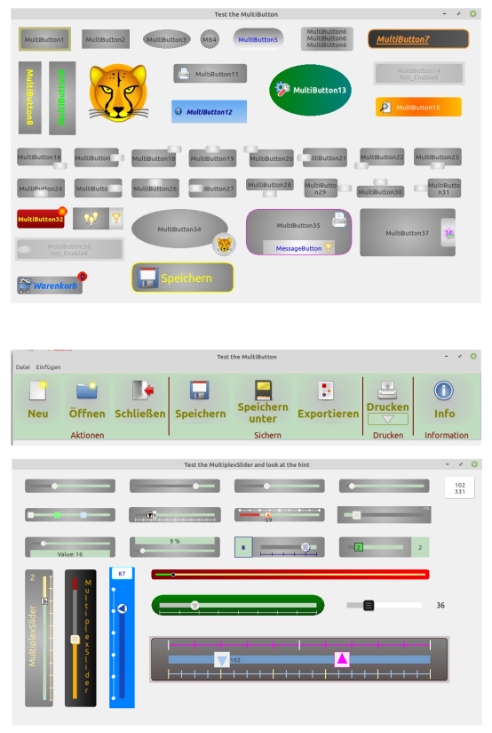

# Multis - This is a package with components created for Lazarus
The package currently contains:    
-TMultiButton, a button with an integrated messagebutton   
-TMultiButtonStylemanager, makes it easier to manage the properties when using several MultiButtons   
-TMultiplexSlider, a slider with up to 3 knobs    
-TSeperator, just an optical element in the look of the multis. To be used between controls.   
The components are characterized by the fact that they have many user-defined properties and their appearance is almost the same on different OS.
I developed and tested it under Linux Mint 64bit. I compiled it under Windows 64 and 32 bit, Linux 32 bit, Linux with qt and FreeBSD.  
For more Information see: https://www.lazarusforum.de/viewtopic.php?p=125633#p125633  
  

